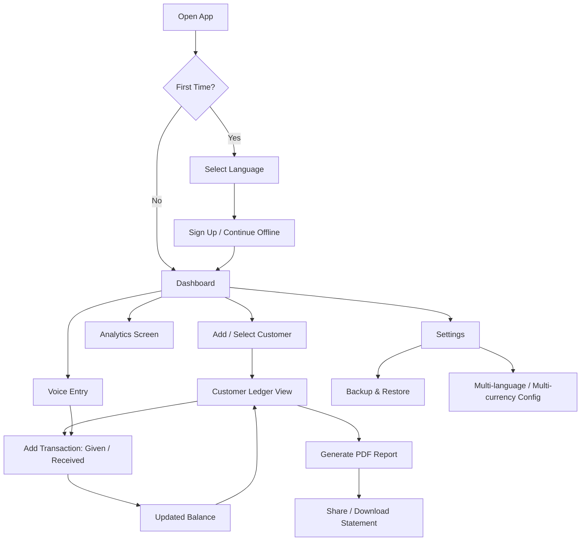

# HisabDo Capstone — Day 8: Product Analysis & Architecture

**Track:** MERN / Next.js
**Product studied:** HisabDo — Offline Khata, Ledger & Expense App
**Website:** https://hisabdo.app/
**App:** https://play.google.com/store/apps/details?id=com.usman.hisabdo

---

## 1. Product Overview

HisabDo is an **offline-first digital khata (ledger) app** for shopkeepers, freelancers, and small business owners. It replaces the paper register used across South Asia for tracking *udhar* (credit given/taken).

Core value props from the product site:
- Offline-first — core records live on-device, sync/backup is optional
- Customer-wise ledger with running balances
- PDF export of statements/reports
- Voice entry for faster transaction logging
- Multi-language (Urdu, English, Hindi, Arabic, Roman Urdu) and multi-currency (PKR, USD, INR)
- Cloud backup & restore

Core screens observed: **Dashboard, Customers, Transactions, Analytics, Ledger, Voice Entry.**

---

## 2. Complete User Journey (Mobile App)

1. **Onboarding** — Open app → select language → (optional) sign in / continue without account
2. **Dashboard** — See total receivable, total payable, quick actions
3. **Add Customer** — Create a customer profile (name, phone, opening balance)
4. **Record Transaction** — Log "money given" or "money received" against a customer, optionally via voice
5. **View Customer Ledger** — Open a customer to see full transaction history and running balance
6. **Analytics** — View charts/summaries of business performance over time
7. **Generate Report** — Export a PDF statement for a customer or a date range
8. **Backup/Restore** — Protect and recover data, optionally sign in for cloud sync
9. **Share Statement** — Send PDF to a customer via WhatsApp/other apps

### User Flow Diagram



---

## 3. Website Page List (Next.js Marketing Site)

| Page | Route | Purpose |
|---|---|---|
| Home | `/` | Hero, features, screenshots, CTA (mirrors current site) |
| About | `/about` | Company/product story, founder profile |
| Features | `/features` | Detailed feature breakdown |
| Pricing | `/pricing` | Free vs. planned premium tiers (if applicable) |
| Blog (index) | `/blog` | Guides & comparison articles |
| Blog (post) | `/blog/[slug]` | Individual article |
| FAQ | `/faq` | Common questions |
| Contact | `/contact` | Contact form / support |
| Login | `/login` | Auth entry |
| Register | `/register` | Account creation |
| Forgot Password | `/forgot-password` | Password recovery |
| Dashboard (app) | `/dashboard` | Post-login web app home |
| Terms & Privacy | `/legal/terms`, `/legal/privacy` | Compliance pages |

---

## 4. Web Application Module List (Derived from Mobile App)

1. **Authentication Module** — register, login, JWT refresh, forgot/reset password, session handling
2. **Dashboard Module** — receivable/payable summary cards, recent activity, quick-add actions
3. **Customer Management Module** — CRUD for customers, search/filter, per-customer ledger & balance
4. **Transaction Module** — record money given/received, edit/delete, categorize, attach notes
5. **Ledger Module** — chronological, filterable transaction history per customer or globally
6. **Analytics Module** — charts for cash flow, top debtors/creditors, trends over time (Recharts)
7. **Reports Module** — generate & download PDF statements, date-range reports
8. **Notifications Module** — due-date reminders, payment received alerts, in-app + email
9. **Backup/Restore Module** — export/import data, cloud sync settings
10. **Admin Dashboard Module** — user management, system-wide analytics, moderation
11. **Settings Module** — profile, language, currency, business info
12. **Background Jobs Module** — scheduled reminders, automated backups, report generation queue

---

## 5. Basic Next.js Folder Structure

```
hisabdo-web/
├── app/
│   ├── (marketing)/          # Public website
│   │   ├── page.tsx           # Home
│   │   ├── about/
│   │   ├── features/
│   │   ├── pricing/
│   │   ├── blog/
│   │   │   └── [slug]/
│   │   ├── faq/
│   │   ├── contact/
│   │   └── layout.tsx
│   ├── (auth)/                # Auth pages
│   │   ├── login/
│   │   ├── register/
│   │   ├── forgot-password/
│   │   └── layout.tsx
│   ├── (dashboard)/           # Authenticated web app
│   │   ├── dashboard/
│   │   ├── customers/
│   │   │   └── [id]/
│   │   ├── transactions/
│   │   ├── ledger/
│   │   ├── analytics/
│   │   ├── reports/
│   │   ├── notifications/
│   │   ├── settings/
│   │   └── layout.tsx
│   ├── (admin)/                # Admin dashboard
│   │   └── admin/
│   │       ├── users/
│   │       ├── customers/
│   │       ├── transactions/
│   │       ├── reports/
│   │       └── settings/
│   ├── api/                    # Next.js route handlers (BFF layer)
│   │   ├── auth/
│   │   ├── customers/
│   │   ├── transactions/
│   │   ├── reports/
│   │   └── notifications/
│   ├── layout.tsx
│   └── globals.css
├── components/
│   ├── ui/                     # Buttons, inputs, modals (design system)
│   ├── layout/                 # Navbar, Sidebar, Footer
│   ├── dashboard/               # StatCard, RecentTransactions
│   ├── charts/                 # BalanceChart, TrendChart
│   └── forms/                  # CustomerForm, TransactionForm
├── lib/
│   ├── db/                     # Mongoose connection helper
│   ├── hooks/                  # useAuth, useCustomers, etc.
│   ├── validators/              # Zod schemas
│   └── utils/                  # formatCurrency, dateHelpers
├── server/                     # Standalone Express API (MERN backend)
│   ├── models/                 # User, Customer, Transaction (Mongoose)
│   ├── controllers/
│   ├── routes/
│   ├── middleware/             # auth, error handling
│   ├── jobs/                   # cron: reminders, backups, report generation
│   └── config/                 # db.js, env config
├── public/
│   └── images/
├── styles/
├── docs/                       # Analysis, ADRs, diagrams (this file lives here)
├── .gitignore
├── package.json
└── README.md
```

**Architecture note:** Two viable backend approaches were scaffolded for flexibility:
- `app/api/*` — Next.js Route Handlers acting as a thin BFF (good for simple CRUD, deploys with the frontend)
- `server/*` — a separate Express + MongoDB service (matches "MERN" more literally, better for background jobs, websockets, and heavier business logic)

We'll decide/confirm which one is primary once backend requirements firm up in later milestones; the current structure supports either or both (Next.js API proxying to the Express service).

---

## 6. Proposed Technology Stack

| Layer | Choice | Reason |
|---|---|---|
| Frontend framework | Next.js 14 (App Router) | SSR/SSG for marketing pages, file-based routing, API routes |
| Language | TypeScript | Type safety across a multi-module app |
| Styling | Tailwind CSS | Fast, consistent, responsive-first |
| State management | Zustand | Lightweight, avoids Redux boilerplate for this scope |
| Forms & validation | React Hook Form + Zod | Shared validation schemas client & server |
| Backend | Node.js + Express | Standard MERN API layer for `server/` |
| Database | MongoDB + Mongoose | Matches mobile app's flexible, document-style ledger records |
| Auth | JWT (access + refresh tokens), bcrypt for hashing | Stateless auth, works well across web/admin |
| Charts | Recharts | React-native charting for Analytics module |
| PDF generation | pdf-lib / puppeteer (for reports) | Matches app's PDF export feature |
| Notifications | node-cron + email (Nodemailer) / web push | Due-date reminders, background jobs |
| Background jobs | node-cron (simple) → BullMQ + Redis (if scaling) | Report generation, backups, reminders |
| Realtime (optional) | Socket.io | Live notification delivery in dashboard |
| Deployment | Vercel (frontend) + Render/Railway (API + MongoDB Atlas) | Free-tier friendly for an internship project |
| Version control / CI | GitHub + GitHub Actions | Lint/build checks on PRs |

---

## 7. UI/UX Improvement Suggestions (5–10)

1. **Add a global search bar** on the dashboard to jump to any customer instantly instead of scrolling a list.
2. **Color-code balances consistently** (e.g., green = receivable/owed to you, red = payable/you owe) across dashboard, ledger, and reports — the current screenshots don't make this instantly scannable.
3. **Add empty-state illustrations/guidance** for new users with zero customers/transactions, guiding them to "Add your first customer."
4. **Introduce due-date reminders with visible badges** (e.g., "3 payments overdue") on the dashboard, not just buried in notifications.
5. **Make the PDF report customizable** — let users add a business logo/header before exporting, so it looks more professional when shared with customers.
6. **Improve onboarding** with a short interactive walkthrough (3–4 screens) instead of dropping users straight onto an empty dashboard.
7. **Add a lightweight web/desktop companion** (this capstone) so shop owners can enter data on a bigger screen and it stays in sync with mobile.
8. **Bulk actions** for transactions (multi-select to delete/export/categorize) to save time for high-volume users.
9. **Dark mode**, given the target users often check balances in dim shop environments at night.
10. **Currency formatting consistency** — ensure thousand separators and currency symbols are locale-aware (PKR vs USD vs INR) throughout, not just on the dashboard.

---

## 8. Feature Gaps / Missing Features Observed

- No visible **invoicing** feature (only ledger/khata tracking) — could be a differentiator for the web app.
- No mention of **multi-user/staff accounts** for a single business (e.g., shop owner + employee access).
- No **recurring transaction** support (e.g., monthly rent, subscriptions) visible in marketing material.
- Notifications/reminders for due payments aren't highlighted as a core feature — worth strengthening in the web app.

---

## 9. Performance & Technical Recommendations

- Use **SSG/ISR** for marketing pages (home, blog, FAQ) since content changes infrequently — improves load time and SEO.
- **Lazy-load charts** (Analytics module) since Recharts/D3-style libraries are heavy — only load on route visit.
- Index MongoDB collections on `customerId` and `date` fields early, since ledger queries will filter/sort by these constantly.
- Use **optimistic UI updates** for transaction entry (mirrors the offline-first feel of the mobile app) with background sync/reconciliation.
- Add **rate limiting** and input validation (Zod) on all API routes from day one, especially auth and transaction endpoints.

---

## 10. User Feedback Activity (Template)

To be completed after introducing the mobile app to 5+ real users:

| # | User Type | Installed (Y/N) | Liked Most | Confusing/Disliked | Suggestion |
|---|---|---|---|---|---|
| 1 | | | | | |
| 2 | | | | | |
| 3 | | | | | |
| 4 | | | | | |
| 5 | | | | | |

**Summary of installation count:** _(fill in)_
**Key themes across feedback:** _(fill in)_

---

## 11. Next Steps (Beyond Day 8)

- Confirm final backend approach (Next.js API routes vs. standalone Express service vs. hybrid)
- Design MongoDB schemas for `User`, `Customer`, `Transaction`, `Report`
- Set up authentication flow end-to-end (register/login/JWT)
- Build design system components (`components/ui`) before feature pages
- Wire up CI (lint + build) on GitHub Actions
