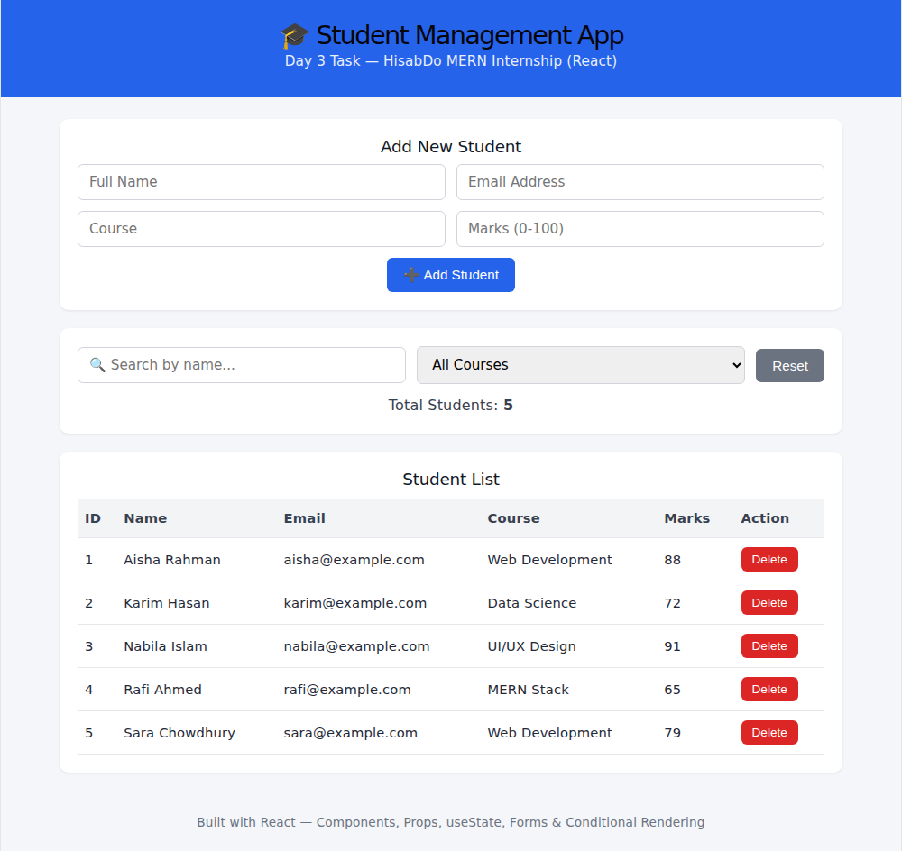
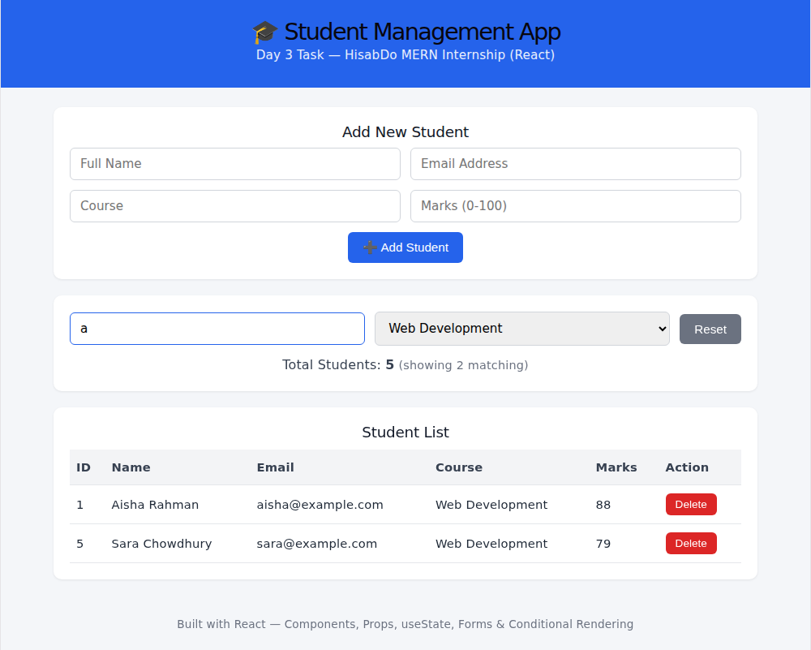

# HisabDo Internship Bootcamp — Day 3 (MERN Track)

## 📚 What I Learned & Practiced

- **React Components**: Split the UI into small, focused components —
  `AddStudentForm`, `SearchFilterBar`, `StudentList`, `StudentItem`.
- **Props**: Data and functions flow down from `App` into child components
  as props (e.g., `students`, `onDelete`, `onAddStudent`).
- **useState**: Used to manage students, search term, and course filter as
  React state.
- **Forms & Controlled Inputs**: The "Add Student" form and search/filter
  inputs are controlled components tied to state.
- **Event Handling**: `onSubmit`, `onChange`, and `onClick` handlers connect
  user actions to state updates.
- **Array `.map()`**: Used to render the list of students and to build the
  course dropdown options.
- **Conditional Rendering**: Shows a "No students found" message when a
  search/filter returns no results.
- **Basic CSS**: Clean, card-based styling in `App.css`.

## 💻 What I Built

A **Student Management React App** (data stored in React state only — no
backend yet, as instructed).

### ✅ Features
1. **Display all students** in a table.
2. **Add a new student** via a form (name, email, course, marks).
3. **Search students by name** — live search.
4. **Filter students by course** — dropdown populated dynamically from
   existing student data.
5. **Delete a student** from the list.
6. **Display total number of students**, plus a live "matching" count when
   search/filter is active.

## 📁 Project Structure
```
hisabdo-day3/
├── src/
│   ├── components/
│   │   ├── AddStudentForm.jsx
│   │   ├── SearchFilterBar.jsx
│   │   ├── StudentList.jsx
│   │   └── StudentItem.jsx
│   ├── data/
│   │   └── initialStudents.js
│   ├── App.jsx
│   ├── App.css
│   └── main.jsx
├── screenshots/
│   ├── main-view.png
│   └── search-filter-view.png
├── index.html
├── package.json
└── README.md
```

## ▶️ Setup Instructions

```bash
# 1. Install dependencies
npm install

# 2. Run the development server
npm run dev

# 3. Open the local URL shown in the terminal (usually http://localhost:5173)
```

To create a production build:
```bash
npm run build
npm run preview
```

## 🖼 Screenshots

**Main view — all students displayed:**


**Search + course filter combined:**


## ✅ Day 3 Checklist
- [x] Used React (Vite)
- [x] Broke UI into components
- [x] Used props to pass data/functions between components
- [x] Used `useState` for app state
- [x] Built a controlled form for adding students
- [x] Handled events (submit, change, click)
- [x] Used `Array.map()` to render lists
- [x] Used conditional rendering (no-results message)
- [x] Added basic CSS styling
- [x] No Node.js/Express/MongoDB used — pure frontend React with local state
